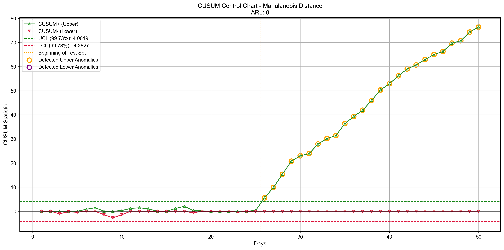

# Drift_detection

This repository provides an implementation for drift detection in sequential data using **Mahalanobis Distance** and **CUSUM control charts**.  
The pipeline includes data preprocessing, statistical modeling, and visualization for detecting distribution shifts over time.

---

## 📊 Quick Start

To run the drift detection pipeline, follow the steps below.

---

### Data Preparation

1. Prepare your raw dataset and place it under the `./data/` directory.

2. The dataset should include at least the following columns:
   - `sample_id`: must be continuous positive integers starting from 1 to N (where N is the total number of samples).
   - `dataset_type`: must be either `calibration` or `test`.
     
       -`calibration`: Represents baseline data under normal conditions. These samples must appear first in the file.
     
       -`test`: Data to be monitored for potential drift. These samples must follow the calibration data and cannot be interleaved. 
   - numerical feature columns

The first column must be sample_id, and the last column must be dataset_type.
   
3. Configure the dataset settings in:
   ```bash
   configuration.json
   ```
### Run the code
 Execute the following command:
```bash
python generating_ood_final.py
```
The execution will automatically generate `MD_result.csv`and place it within the `/data` subfolder.

 Execute the statistical process control analysis and evaluation:
```bash
python spc_final.py
```
### Outputs

- `Evaluation Metrics`: A file named `drift_evaluation_results.csv` will be saved in the `/data` folder.
- `Visualization`: A control chart named `cusum_MD.png` will be generated in the `/drift_charts` directory.


---

## 🧪 Experimental Validation & Results

To demonstrate the reliability of the detection pipeline, we conducted a comprehensive simulation using the provided scripts.

### 1. Validation Process
The validation follows a structured two-stage workflow using a synthetic dataset of **1,000 samples** with a **bivariate standard normal distribution**:

* **Temporal Scale**: For realistic interpretation, the data is partitioned into daily intervals, with **20 samples representing 1 day** (totaling 50 days of monitoring).
* **Baseline Calibration**: The first 500 samples (Days 1–25, labeled as `calibration`) are used to fit the empirical distribution of Mahalanobis Distances. This stage establishes the "normal" operational profile under stable conditions.
* **Drift Monitoring**: The subsequent 500 samples (Days 26–50, labeled as `test`) are used for real-time monitoring. To simulate real-world data drift, a **mean shift** was introduced starting from the "test" phase, while maintaining the original covariance structure.


### 2. Results Display


The results shown below are generated based on a simulated dataset for validation purposes. These results demonstrate the algorithm's capability to detect shifts but may differ from the specific clinical metrics reported in the paper due to data privacy (e.g., MIMIC-IV access restrictions).

The analysis yields two primary outputs that can be found in this repository:

#### **A. CUSUM Control Chart**
The visualization below (stored in `/drift_charts`) illustrates the core detection logic. The **blue and red lines** represent the cumulative sum of positive and negative deviations. When either line crosses the **dashed control limits**, a drift alarm is triggered.



#### **B. Quantitative Evaluation**
The performance of the drift detection pipeline is evaluated using the Average Run Length (ARL), which measures the delay between the drift onset and the first alarm. The result is exported to `data/drift_evaluation_results.csv`. 


| Method | Metric | ARL | 
| :--- | :--- | :--- | 
| CUSUM | Mahalanobis Distance (MD) | 0 days | 


* **Detection Delay**: Our results indicate that the drift was successfully captured within a very short interval after the onset, proving the high sensitivity of the Mahalanobis-CUSUM approach.

---


